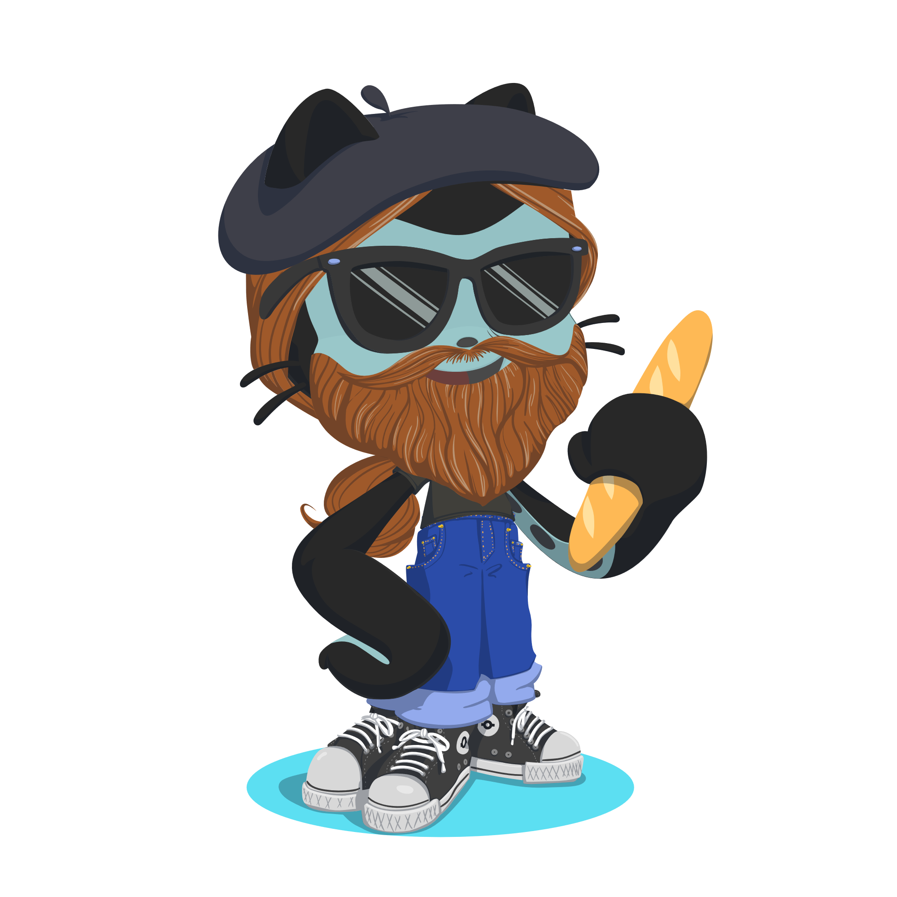

<h1 align="center">Hi 👋, I'm Guillaume</h1>
<h3 align="center">A developer from France</h3>

  
<h2 align="left">⚡️ A Quick Overview</h2>

- 👀 I’m interested in **a lot of stuff actually**

- 🔭 I’m currently working on [my personal portfolio on which I just can't stop but add features and no actual content at all](https://github.com/EvilYep/Online-CV)

- 🌱 I’m currently learning **totallly unrelated stuff (Unity), and also keeping up with Laravel and Vue.js**

- 👯 I’m looking to collaborate on **anything interesting my low experience would allow me to**

- 🤝 I’m looking for help with [my previous idea of a portfolio that "plays" like a video game](https://github.com/EvilYep/Portfolio)

- 💬 Ask me about **how Portal 2 is the best game ever**

- 👾 I love retro aesthetics and will try to implement the [Konami code](https://gist.github.com/EvilYep/7458b242d88ccfd91089591256c7ca80) whenever and wherever I can

- 📫 How to reach me **guillaume.moneret@gmail.com**

- ⚡ Fun fact : **When I was young and we didn't care about how planes ruin the planet, in New Zealand, I skydived above Mordor**

<h3 align="center">Connect with me:</h3>

 

  

<h2 align="left">🔨 What I play with</h2>

       

        

<h3 align="center">Favourite browser</h3>

  

  

	📈 Some more stats for data lovers

 
  
&nbsp;
  

  

  

Here's a random joke for your enjoyment

